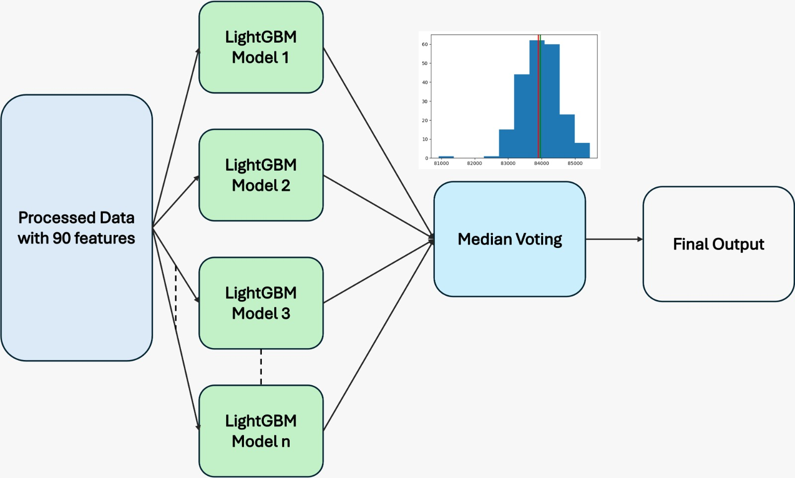

# prc_atow_tbp
We are team_brave_pilow
Here is our model developed in the scope of EUROCONTROL's PRC Data Challenge.

## Preprocessing

In the preprocessing stage we used opensource tools, such as OpenAP, Traffic, AirportsData.
The requirements are given in `requirements.txt`

The preprocessing consists of several stages.
1. Resampling and deriving addintional trajectory features in `preprocessing.py`:

To run this file the "data" folder should contain all the trajectoy data. This script will create "processed" folder and store there processed flight .parquet files.

2. Extracting trajectory features in `trajectory_df.py`:

Here we extract the features from the trajectory data in "processed" folder and create a new dataframe `traj_df.parquet`. this script also create "traj_dfs" folder, where the flights are stored 365 files for each day in a year. This is made to keep the progress even in case of aborting running of script. This folder is not used after "traj_df.parquet" file is created.

3. Merging features together:

    1. `all_features.py` file merges trajectory features ("traj_df.parquet") with the other features provided in "challenge_set.csv" and "final_submission_set.csv"

    2. adding more climb-phase data:
    At some point we realized that climb-phase is quite important, and decided to extract more features from climb phase.
        (1) Preprocessing is similar, but now we didn't resample data, so we don't miss anything. The script is `preprocess_climb.py`
        (2) Extracting features `climb_features.py`
    
    3. `add_features.py` file add more features such as airport distance,
  
4. Processing:
   We proposed two model:

   a. `Median voting`, where we trained numerous model (thanks to our trial and error, and also for loop!) and select the final result from the median of the predicted value from each. 
       We uses this architecture because we realized that the deviation of each prediction using different features deviates differently from the ground truth. Thus, following the law of 
       large number, the median voting can be helpful. This results in 2318 rmse. However, this model has several drawbacks. First, it is very time-consuming to train the all models, 
       around 2 minutes each. Second, this model relies heavily on the "base" features and model. We got 2250-ish before the final_submission_set was released, thanks to the good 
       features and/or model parameters. Unfortunately, we could not reproduce it, it was a messy day where we trained so many models, explored so many ML techniques, and lost track of 
       it (or you may say it was beginner's luck).
   
   b. `RMSE filtering`, where we trained different model according to number of aircraft type (the aircraft type with <1% population is merged into one). This is done by performing an 
       undersampling on the other aircraft type and focusing on the aircraft-type-of-interest. Then, each model is trained under this samples and the validation rmse for each aircraft 
       type is logged, both in in training and validation. Then, we select the model that has the lowest rmse to estimate the take-off weight. This got us 2066-ish rmse in our validation 
       set. However, we cannot reproduce this result for the final_sub set and achieve only 2335-ish. This model, in our opinion, is still better than training more models to squeeze 
       water out of a stone and got only slightly better results.

### The final model structure:

